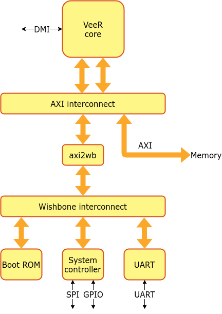

# Veerwolves - daisy chain Veerwolf core SoCs
## * WORK IN PROGRESS * UNDER CONSTRUCTION * KNOWN ISSUES!!!!!!!
> WHILE THIS NOTICE IS PRESENT, DON'T EXPECT DESIGN, SIM, OR ANY OTHER FILE IN HERE 2BE DOIN' WHAT IT'S SAYIN'

This work was inspired by the Intel [whitepaper](https://cdrdv2-public.intel.com/833305/comparing-the-real-world-capacity-of-agilex-5-fpgas-whitepaper.pdf) comparing Intel Agilex 5 series to Lattice Avant-E, addressing true logic capacity of these FPGA families. In particular, it investigates how Cologne Chip's GateMate handles larger cores and explores the maximum number of these that can be integrated into a daisy chain configuration. Given that a 222k LUT6 FPGA can accommodate roughly 18 cores, successfully fitting even one or two cores would be considered a considerable achievement.

## Testing strategy
We'll quickly explain the benchmark setup and what it aims to achieve, for a more detailed explanation please refer to this  [whitepaper](https://cdrdv2-public.intel.com/833305/comparing-the-real-world-capacity-of-agilex-5-fpgas-whitepaper.pdf). This test realizes a daisy-chain serial SoC connection via UART (as shown in the figure below), with the maximum number of SoCs instantiated being the output metric.

Unlike Corescore, this design features a more homogenous logic mapping (Corescore was just a lot of independent cores feeding into a wide mux). Each SoC incorporates several interconnect conversions—primarily from AXI to WB and back—which are confined locally due to the daisy chain configuration. This setup exemplifies the FPGA’s short-wiring capabilities and raises questions about how densely the logic can be packed and what impact this may have on timing performance.


The VeeR EL2 CPU serves as the core of the SoC and integrates the previously described AXI and WB conversions. This RV32IMC-compliant RISC-V core, complete with a branch predictor, represents the first instance of the CCGM1A1 handling multiplication and implementing a more complex architecture. The figure below illustrates the CPU design.

 
## Build steps
FuseSoC is again the framework for generating an arbitrary number of cores. Add FuseSoC libraries after entering this folder:
```
cd 4.veerwolves
fusesoc library add veerwolf ./
```
Generating the bitstream for CologneChip is done by running:
```
fusesoc run --target=gatemate_pack veerwolf
```


## Results and analysis
```
CPE Component Statistics:
          OR      3202         8%
         AND     17296        45%
         XOR      1553         4%
       ANDOR         1         0%
       ORAND      5170        13%
       ICOMP       260         0%
        MX2a      3873        10%
        MX4a      2764         7%
      ANDXOR       146         0%
        ADDF       182         0%
       ADDF2      2458         6%
       ADDFx         7         0%
      ADDF2x        42         0%
        MULT       684         1%
      MULTFa        13         0%
      MULTFb        11         0%
      Route1        53         0%
              --------
Sum of COMB:     37715

           D      8879        95%
         DST        32         0%
       C_0_1       268         2%
      RAM_I1        70         0%
      RAM_I2        59         0%
              --------
Sum of SEQ:       9308

Sum of all:      47023


Number of CPEs on layer    1 / 2:   8828 / 8444
Number of CPEs using layer 1 + 2:  16356
Number of needed CPEs        / available CPEs:     25184 / 20480
Number of needed IO-Pins     / available IO-Pins:     36 / 144
ChipSize:     X: 160  Y: 128

FPGA too small for circuit!
```

Comparable Gowin Arora GW2AR-18C device doesn't fare any better in this test: 
```
ERROR (RP0006) : The number(28340(26008 LUTs, 2284 ALUs, 0 ROM16s, 8 SSRAMs)) of logic in the design exceeds the resource limit(20736) of current device
GowinSynthesis finish
```